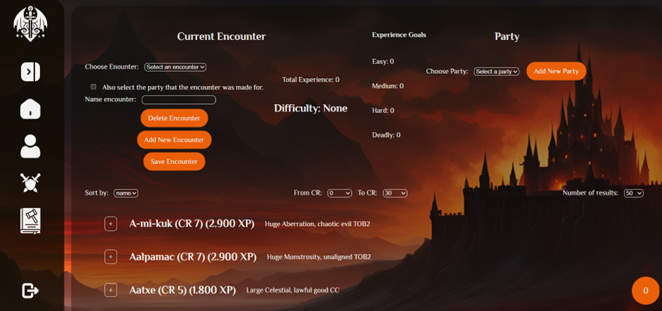

# Tale Tools – D&D 5e Dungeon Master Tool

## Inleiding

Deze applicatie is een webgebaseerde tool ter ondersteuning van het spelen en voorbereiden van **Dungeons & Dragons 5e**.

De applicatie stelt gebruikers in staat om informatie uit de officiële **D&D 5e API** op te halen en te gebruiken bij het samenstellen en analyseren van encounters. Gebruikers kunnen monsters zoeken en filteren, partijen samenstellen met spelers van verschillende levels en encounters opbouwen op basis van deze gegevens.

De applicatie berekent automatisch de moeilijkheidsgraad van een encounter volgens de officiële D&D-regels en geeft inzicht in de bijbehorende ervaring (XP). Daarnaast beschikt de applicatie over een authenticatiesysteem waarmee gebruikers kunnen inloggen en hun encounters lokaal kunnen opslaan in de browser.

Door het gebruik van **React** en **JavaScript** is de applicatie dynamisch opgebouwd en reageert de interface direct op gebruikersacties zonder herladen van de pagina.

Het doel van deze applicatie is om **Dungeon Masters** te ondersteunen bij het voorbereiden van gebalanceerde encounters, zonder dat zij handmatig regels, tabellen of externe hulpmiddelen hoeven te raadplegen.



---

## Benodigdheden

Om deze applicatie lokaal te kunnen draaien zijn de volgende zaken vereist:

- **Node.js** (versie 18 of hoger, inclusief npm)
- **Git**
- **WebStorm** of een andere IDE (bijvoorbeeld VS Code)
- Een moderne webbrowser (Chrome, Firefox of Edge)

### Externe API’s

Deze applicatie maakt gebruik van:
- een **Dungeons & Dragons 5e API**
- een **externe backend voor authenticatie**

Voor beide API’s zijn **geen API-keys vereist**.  
De benodigde API-URL’s zijn opgenomen in de sourcecode en worden automatisch gebruikt.

---

## Installatiehandleiding – Stap-voor-stap (Windows)

### Stap 0 – Vooraf

Zorg dat alle benodigdheden uit de lijst hierboven zijn geïnstalleerd voordat je begint.

---

### Optionele methode – Project clonen via WebStorm

1. Start WebStorm

2. Kies **Get from Version Control**

3. Plak de repository-URL

    ```
    https://github.com/dkuiper87/tale-tools.git
    ```

4. Kies een lokale opslaglocatie

5. Klik op **Clone**

WebStorm maakt de projectmap aan en opent deze automatisch.

Ga verder naar **Stap 5 – Terminal openen in WebStorm**.

---

### Stap 1 – Een terminal openen in Windows

Indien je niet gebruikmaakt van de optionele WebStorm-methode hierboven, beginnen we met het clonen van het project via een Windows-terminal

#### Optie A – PowerShell openen (aanbevolen)

1. Druk op de **Windows-toets**
2. Typ: `PowerShell`
3. Klik op **Windows PowerShell**

Je ziet nu een blauw venster met een knipperende cursor. Dit is de terminal waarin we Git-commando’s gaan uitvoeren.

#### Optie B – Command Prompt (alternatief)

1. Druk op **Windows-toets + R**
2. Typ: `cmd`
3. Druk op **Enter**

---

### Stap 2 – Kies een locatie voor het project

In de terminal bepaal je waar het project wordt opgeslagen.

Bijvoorbeeld naar je documentenmap:

```bash
cd Documents
```
Of naar een specifieke map:

```bash
cd C:\Programmeren\Projects
```

Bestaat de map nog niet? Dan kun je deze aanmaken met:

```bash
mkdir tale-tools
cd tale-tools
```

---

### Stap 3 – Project clonen vanaf GitHub

Clone de repository met de HTTPS-URL:

```bash
git clone https://github.com/dkuiper87/tale-tools.git
```

Wat gebeurt hier:

- Git downloadt de volledige broncode

- Er wordt automatisch een nieuwe projectmap aangemaakt

- Alle bestanden worden lokaal opgeslagen

---

### Stap 4 – Project openen in WebStorm

1. Start **WebStorm**

2. Kies **Open**

3. Selecteer de zojuist gekloonde projectmap

4. Klik op **OK**

WebStorm herkent automatisch dat dit een bestaand JavaScript/Vite-project is.

---

### Stap 5 – Terminal openen in WebStorm

Zodra het project geopend is:

Klik onderin op **Terminal**

De terminal staat nu automatisch in de juiste projectmap.

---

### Stap 6 – Dependencies installeren

Wanneer het project voor de eerste keer wordt geopend in WebStorm, verschijnt rechtsonder meestal een melding met de vraag of `npm install` uitgevoerd moet worden. Klik in dat geval op deze melding.

Verschijnt deze melding niet, of maak je gebruik van een andere IDE?  
Open dan de terminal in je IDE en voer het volgende commando uit:

```bash
npm install
```

Wat gebeurt hier:

- Alle benodigde packages worden automatisch gedownload

- De informatie komt uit het package.json-bestand

- Handmatige installatie is niet nodig

Dit kan enkele minuten duren.

---

### Stap 7 – Applicatie starten

Start de ontwikkelserver met:
```bash
npm run dev
```

Na het opstarten verschijnt een melding zoals:
```bash
Local: http://localhost:5173/
```

---

### Stap 8 – Applicatie openen in de browser

Open een webbrowser en ga naar:
```bash
http://localhost:5173
```

De applicatie is nu lokaal actief en klaar voor gebruik.

---

### Inloggen / accounts

De applicatie maakt gebruik van een externe backend voor authenticatie.

Omdat deze backend periodiek (ongeveer elke 24 uur) wordt gereset, zijn er geen vaste testaccounts beschikbaar.
De gebruiker kan zelf een account aanmaken via de registratiefunctionaliteit in de applicatie en daarna direct inloggen.

---

### Beschikbare npm-commando’s

De volgende npm-scripts zijn beschikbaar binnen dit project:
```bash
npm run dev
```

Start de Vite development server met hot reload voor lokaal ontwikkelen.
```bash
npm run build
```

Bouwt een geoptimaliseerde productieversie van de applicatie in de dist-map.
```bash
npm run preview
```

Start een lokale server om de productiebuild te previewen.

Voor het nakijken van de applicatie is alleen `npm run dev` noodzakelijk.

---

### Controle Node.js installatie

Indien de applicatie niet start, controleer of Node.js correct is geïnstalleerd:

```bash
node -v
```

De versie moet 18 of hoger zijn.